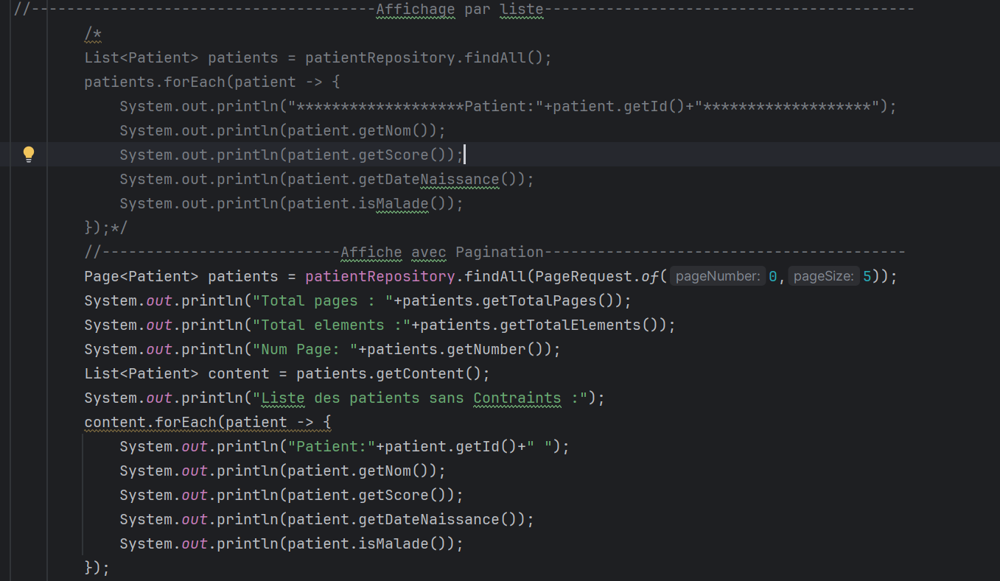

# Rapport

Introduction :

La gestion efficace de la persistance des données est un élément clé dans le développement d'applications. 
Au fil du temps, diverses technologies ont évolué pour relever ce défi, de l'ORM au JDBC, en passant par des cadres tels que JPA, Hibernate et Spring Data. Ces avancées ont révolutionné la manière dont les développeurs interagissent avec les bases de données en proposant des solutions flexibles et robustes.

Ce travail pratique se concentre sur une exploration approfondie de ces concepts essentiels. Nous avons examiné les différentes couches de l'architecture de persistance, depuis l'accès aux bases de données avec JDBC jusqu'à l'utilisation de JPA pour simplifier la gestion des objets persistants. En plus de cela, nous avons exploré Hibernate, un framework ORM populaire facilitant la liaison entre les objets Java et les bases de données relationnelles. Enfin, nous avons plongé dans Spring Data, un composant puissant du framework Spring, simplifiant davantage la gestion des données en fournissant une interface cohérente et flexible pour la persistance.
L'objectif était de mettre en lumière les avantages, les fonctionnalités clés et les scénarios d'utilisation de ces technologies, tout en illustrant leur mise en œuvre pratique.

**Énoncé :**

1. Installer IntelliJ Ultimate
2. Créer un projet Spring Initializer avec les dépendances JPA, H2, Spring Web et Lombok
3. Créer l'entité JPA Patient ayant les attributs :
    - id de type Long
    - nom de type String
    - date de naissance de type Date
    - malade de type boolean
    - score de type int
4. Configurer l'unité de persistance dans le fichier application.properties
5. Créer l'interface JPA Repository basée sur Spring Data
6. Tester quelques opérations de gestion :
    - Ajouter des patients
    - Consulter tous les patients
    - Chercher un patient par Id
    - Mettre à jour un patient
    - Supprimer un patient
7. Migrer de H2 Database vers MySQL

**Architecture JPA :**

**TP :**

1. Installation d'IntelliJ Ultimate
   La première étape de ce travail pratique consiste à procéder à l'installation d'IntelliJ IDEA Ultimate, un environnement de développement intégré (IDE) de grande puissance, qui va nous servir pour le développement de notre application.

2. Création d'un Projet Spring Initializer ,Maven avec  les dépendances suivantes :
    - Spring Data JPA
    - H2 Database (base de données en mémoire)
    - Spring Web 
    - Lombok (Generation du code automatique)
    - MySQL Driver
    - Thymeleaf

3. Création de l'Entité JPA Patient :
   Voici les attributs de cette entité :
    - id de type Long
    - nom de type String
    - date de naissance de type Date
    - malade de type boolean
    - score de type int
      

4. Configuration de l'unité de persistance dans le fichier application.properties pour utiliser H2 Database :
   Ces lignes de configuration définissent l'URL de la base de données (H2 en mémoire), activent la console H2 pour une gestion interactive, et spécifient le port (8082) sur lequel l'application sera accessible.
   

5. Création de l'interface JPA Repository basée sur Spring Data :
   Cette interface "PatientRepository" étend "JpaRepository" pour gérer l'accès aux données de l'entité "Patient". Il fournit des méthodes pour rechercher des patients par différents critères, notamment le statut de maladie, le score, la date de naissance et le nom, ainsi qu'une requête personnalisée pour la recherche.
   

6. Tests des Opérations de Gestion :
    - Le point d'entrée de l'application Spring Boot
      
    - Ajouter des patients
      
    - Consulter tous les patients
      
    - Chercher des patients selon des critères
      
    - Chercher un patient par Id
      
    - Mettre à jour un patient
      
    - Supprimer un patient
      
    - Exécution avec H2 
      
      
    - Les données dans H2 Database
      
      

7. Migration de H2 Database vers MySQL :
    - Configuration de l'unité de persistance dans le fichier application.properties pour utiliser MySQL
      
    - Exécution avec MySQL
      
      
    - 
    - Les données dans MySQL Database
      
      

**Conclusion**

Ce projet pratique a plongé au cœur de la gestion complexe de la persistance des données en utilisant des technologies essentielles telles que l'ORM, le JDBC, le JPA, Hibernate et Spring Data.
Notre exploration a mis en lumière la manière dont ces outils puissants simplifient considérablement le processus de développement des applications Java, les rendant robustes et adaptables.

L'expérience a également mis en avant l'importance cruciale du choix judicieux des outils en fonction des exigences spécifiques du projet. La maîtrise de ces concepts et de leur application pratique représente un atout majeur pour les développeurs qui recherchent l'efficacité, la performance et la fiabilité dans leurs applications.

En résumé, cette exploration a élargi notre compréhension des technologies de gestion de la persistance des données, ouvrant ainsi la voie à des projets plus avancés et à une expertise approfondie dans le développement d'applications Java. Elle souligne l'importance cruciale de ces outils dans le paysage moderne du développement logiciel, 
où la gestion efficace des données est un élément clé du succès des projets.